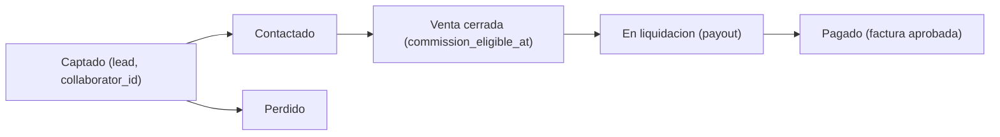

# Flujos de colaboradores — referencia interna

Documentación de los dos funnels principales y las APIs involucradas.

## Terminología única

Se usa el **mismo vocabulario** en panel, portal, landings y docs:

| Término | Significado |
|---------|-------------|
| **Reclutamiento** | Captar colaboradores (`/hazte-colaborador`). |
| **Captación** | Captar clientes (`/ahorra-factura-luz` con `collaborator_id`). |
| **Cliente captado** | Lead con `collaborator_id` (`source = collaborator_referral`). |
| **Venta cerrada (comisionable)** | Estado explícito `leads.commission_eligible_at`, **no** el `status` del pipeline. |
| **Liquidación** | `collaborator_payouts`. |
| **Factura de comisión** | `collaborator_invoices`. |
| **Kit** | Enlace de captación + QR + acceso al portal. |
| **Responsable** | `collaborator_settings.collaborator_manager_id`. |

### Convertido ≠ comisionable

Antes `leads.status = 'converted'` significaba dos cosas (en reclutamiento "ya es colaborador";
en captación "venta cerrada"). Ahora se separan:

- **Reclutamiento**: "Convertir a colaborador" sigue usando `ConvertLeadDialog` (sin cambios).
- **Captación**: la comisión depende **solo** de `leads.commission_eligible_at` (marca de venta cerrada).
  La generación de liquidaciones usa `commission_eligible_at IS NOT NULL`, nunca `status`.

### Ciclo de vida de un cliente captado



Se marca/quita "venta cerrada" desde la lista de **Clientes captados** o desde **LeadDetailSheet**.

---

## Funnel 1 — Reclutamiento de colaboradores

**Ruta:** `/hazte-colaborador` (redirecciones legacy: `/colaboradores`, `/colaboradores/hibrida`)

> Las campañas legacy `colaboradores_compacta` y `colaboradores_hibrida` se migraron a
> `hazte_colaborador` (única campaña activa de reclutamiento).

**Objetivo:** Captar prospectos que quieren unirse al programa de colaboradores.

| Campo lead | Valor |
|------------|-------|
| `source` | `web_form` |
| `campaign` | `hazte_colaborador` |
| `status` | `contacted` (por defecto en API) |
| `custom_fields.landing_type` | `colaboradores` |

**Flujo:**

1. Prospecto rellena `TvForm` en la landing.
2. `POST /api/leads` crea el lead.
3. `POST /api/lead-entries` registra la entrada con UTMs y metadatos de campaña.
4. Admin contacta en CRM → **Convertir a colaborador** → genera kit (enlaces + QR + portal).

**URL opcional (F4):** `?ref={token_reclutador}` atribuye al colaborador referidor (`referred_by_collaborator_id`).

---

## Funnel 2 — Captación de clientes vía colaborador

**Ruta:** `/ahorra-factura-luz`

**Objetivo:** Cliente final ahorra en luz; el lead se atribuye al colaborador.

| Param URL | Uso |
|-----------|-----|
| `?ref={token}` | Enlace firmado (revocable, recomendado) |
| `?collaborator={code}` | Enlace directo por código |
| `?entry=upload\|manual\|callback` | Override de modo de entrada |

| Campo lead | Valor |
|------------|-------|
| `source` | `collaborator_referral` |
| `campaign` | `collaborator:{code}` |
| `collaborator_id` | UUID del colaborador activo |
| `commission_eligible_at` | `timestamptz` · marca de **venta cerrada** (fuente de verdad de comisión) |

**Modos (`entry_mode`):**

| Modo | UX |
|------|-----|
| `auto` | Hero completo → opción subir factura |
| `upload` | Salta a subida de factura |
| `manual` | kWh + importe sin PDF |
| `callback` | Solo contacto |

**APIs:**

- `POST /api/resolve-collaborator-ref` — resuelve token o código.
- `POST /api/leads` — crea lead con `collaborator_id`.
- `POST /api/lead-entries` — entrada CRM.
- `POST /api/process-invoice` — procesa factura adjunta.

---

## Funnel 3 — Portal colaborador (autoservicio)

**Ruta:** `/colaborador/acceso?token={access_token}`

**Objetivo:** Colaborador activo copia enlaces/QR, registra clientes off-landing y sube facturas de comisión.

**APIs:**

- `POST /api/resolve-collaborator-portal` — valida token y devuelve datos del colaborador.
- `POST /api/collaborator-submit-lead` — nuevo cliente atribuido (contacto + factura opcional).
- `POST /api/collaborator-invoice` — factura de comisión vinculada a liquidación.

---

## Payloads API

### POST /api/leads

```json
{
  "name": "María García",
  "phone": "612345678",
  "email": "maria@example.com",
  "source": "web_form",
  "campaign": "hazte_colaborador",
  "collaborator_id": "uuid-opcional",
  "custom_fields": {
    "landing_type": "colaboradores"
  }
}
```

Respuesta: `{ "success": true, "lead": { "id": "..." }, "isNew": true }`

### POST /api/lead-entries

```json
{
  "lead_id": "uuid",
  "source": "web_form",
  "campaign": "hazte_colaborador",
  "adset": "utm_term",
  "ad": "utm_content",
  "collaborator_id": null,
  "custom_fields": {
    "utm_source": "facebook",
    "fbclid": "..."
  }
}
```

### POST /api/resolve-collaborator-ref

```json
{ "ref": "token-firmado", "code": "marta-zona-sur" }
```

Respuesta: `{ "success": true, "collaborator": { "id", "code", "name" }, "entry_mode": "auto" }`

### POST /api/collaborator-submit-lead

```json
{
  "access_token": "...",
  "name": "Cliente",
  "phone": "612345678",
  "email": "cliente@example.com",
  "entry_mode": "upload",
  "attachment_base64": "data:application/pdf;base64,...",
  "attachment_name": "factura.pdf",
  "manual_extraction": { "consumption_kwh": 350, "total_factura": 89.5 }
}
```

---

## Tablas Supabase relevantes

| Tabla | Uso |
|-------|-----|
| `collaborators` | Colaboradores activos |
| `collaborator_referral_links` | Tokens de captación cliente |
| `collaborator_access_tokens` | Tokens de portal autoservicio |
| `collaborator_payouts` | Liquidaciones |
| `collaborator_invoices` | Facturas de comisión del colaborador |
| `leads.referred_by_collaborator_id` | Referidor en reclutamiento |
| `leads.commission_eligible_at` | Venta cerrada / comisionable (fuente de verdad para liquidar) |

---

## Archivos clave

| Área | Archivos |
|------|----------|
| Admin | `src/components/dashboard/CollaboratorsManagement.tsx` |
| Kit / QR | `src/lib/collaborators/*`, `src/components/dashboard/CollaboratorKitMenu.tsx` |
| Portal | `src/pages/ColaboradorPortal.tsx` |
| Clientes captados / comisión | `src/components/dashboard/CollaboratorCapturedClientsSection.tsx` |
| Pagos guiados / liquidación | `src/components/dashboard/CollaboratorPaymentsSection.tsx`, `CollaboratorDetailView.tsx` |
| Landings reclutamiento | `src/pages/HazteColaborador.tsx`, `src/hooks/useColaboradoresLeadSubmit.ts` |
| Captación cliente | `src/hooks/useCollaboratorReferral.ts`, `src/pages/AhorroLuz.tsx` |
| CRM leads | `src/components/dashboard/LeadsManagement.tsx`, `LeadDetailSheet.tsx` |
